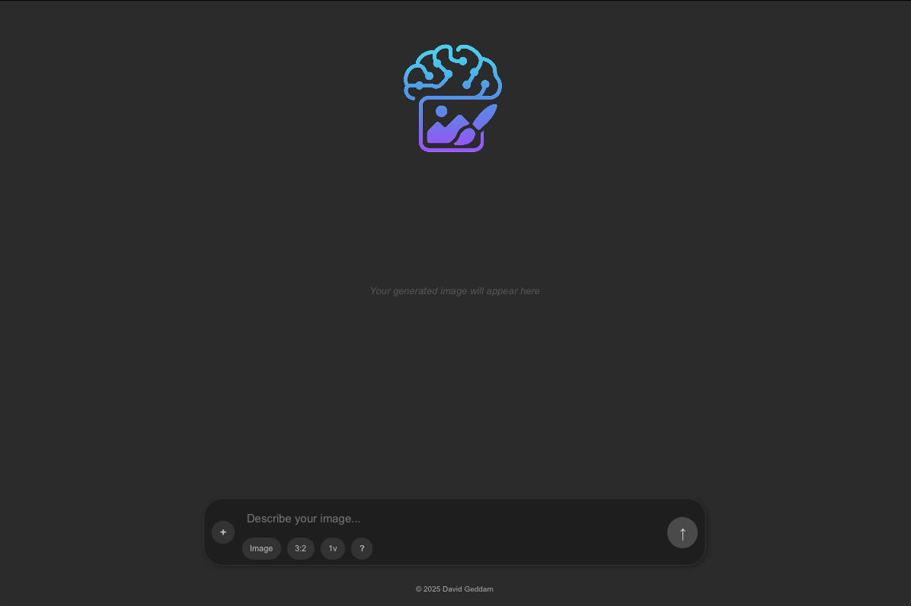

# CUATROS

<p align="center">

</p>

          


## ❔Overview

Cuatros is a block puzzle game where players shift and rotate falling four-square shaped blocks to fill lines horizontally. As the lines of blocks are filled, the lines will be cleared, awarding the player points for each line cleared. As the game progresses, the blocks will fall at a higher rate and will require quicker decision making to survive. The game ends when the player's screen is filled to the top with no more space for another block to spawn. The score is calculated by how many blocks have been placed and the number of lines that have been cleared.

## 🎮 Controls

The controls of this game are quite simple. You can navigate the current block by either using the arrow keys or WASD.
- LEFT ARROW / A - shift block left
- RIGHT ARROW / D - shift block right
- DOWN ARROW / W - move block down
- UP ARROW / S - rotate block
- SPACEBAR - drop block instantly
-  C - hold / change block

## ✨ Story Points: Second Sprint Completion (13 Points)
- Title Screen: 1 point  
- About Screen: 1 point  
- Help Screen: 1 point  
- Game Music: 2 points  
- Game Window: 1 point  

* Gameplay - Spawn Blocks: 1 point
* Gameplay - Controls: 2 points
* Gameplay - Rotate Block: 1 point
* Gameplay - Collisions: 2 points
* Gameplay - Pause Menu: 1 point

## 🎯 Final Sprint Targets (13 Points)
- Scoring: 1 point COMPLETE
- Difficulty Levels (Speed): 1 point COMPLETE
- Leaderboard: 2 points COMPLETE
- Sound Effects: 2 points COMPLETE

* Gameplay - Randomize Block: 2 points COMPLETE
* Gameplay - Show Next Blocks: 1 point COMPLETE
* Gameplay - Line Clearing: 2 points COMPLETE
* Gameplay - Hold Block: 2 points COMPLETE

## Final Sprint: Total Points Completed (27 Points)
- Title Screen: 1 point  
- About Screen: 1 point  
- Help Screen: 1 point  
- Game Music: 2 points  
- Game Window: 1 point 
- Scoring: 1 point
- Difficulty Levels (Speed): 2 points
- Leaderboard: 2 points
- Sound Effects: 2 points
- Gameplay - Spawn Blocks: 1 point
- Gameplay - Controls: 2 points
- Gameplay - Rotate Block: 1 point
- Gameplay - Collisions: 2 points
- Gameplay - Pause Menu: 1 point
- Gameplay - Randomize Block: 2 points
- Gameplay - Show Next Blocks: 1 point
- Gameplay - Line Clearing: 2 points
- Gameplay - Hold Block: 2 points

## Uncompleted Points
- Optional Cheat Mode: 3 points
- Optional Game Levels: 3 points
- Optional Power-ups: 2 points
- Optional Save/Load: 3 points
- Optional Game Modes: 4 points

## 👀 Game Demo (FINAL SPRINT)

🎬 [Watch the demo](CuatrosGame.mp4)


### ✨ CUATROS Title Screen

<p align="center">

</p>

### ✨ CUATROS Game Screen

<p align="center">

</p>

#### System Requirements

> Both MacOS and Windows supported.
> Better optimized for MacOS.


## Code

### 🛠️ Environment Setup

```bash
git clone https://github.com/bjucps209/group-project-team-jd.git
```

#### Gradle Setup

```bash
gradle init --type java-application --dsl groovy --package app --test-framework junit-jupiter --use-defaults --overwrite 
```
#### Gradle commands

```bash
gradle clean build
```

```bash
gradle run
```

#### JavaFX Setup
##### Add a line to app/build.gradle
```bash
plugins {
    id 'application'
    id 'jacoco'
    id 'org.openjfx.javafxplugin' version '0.1.0'
}
```
#### Add a new block to the bottom of app/build.gradle:
```bash
javafx {
    version = "23.0.1"
    modules = [ 'javafx.controls', 'javafx.fxml', 'javafx.media' ]
}
```

## 🎯 Expenses and Contributions


|      Name          | Total Hours | Journal |
|--------------------|-------------|---------------              
|    John Tam        |      35     | [John](https://github.com/bjucps209/group-project-team-jd/wiki/Project-Journal#john-tam)|
|   David Geddam     |      40     | [David](https://github.com/bjucps209/group-project-team-jd/wiki/Project-Journal#david-geddam)|
|  Daniel Cornelius  |     30.5    | [Daniel](https://github.com/bjucps209/group-project-team-jd/wiki/Project-Journal#daniel-cornelius)|

## ✨ Credits

> + John Tam [github.com](https://github.com/jtam496)
> + David Geddam [github.com](https://github.com/dave21-py)
> + Daniel Cornelius [github.com](https://github.com/dcorn713)

## 🚀 Citation

If you find our work useful, please consider citing:

```
title={CUATROS},
  author={John Tam, Daniel Cornelius and David Geddam},
  journal={[Journal](https://github.com/bjucps209/group-project-team-jd/wiki/Project-Journal#david-geddam)},
  year={2025}
}
```

## 📭 Contact

For any questions, please raise a concern or contact us at
+ David Geddam [linkedin.com](https://www.linkedin.com/in/david-geddam/)
