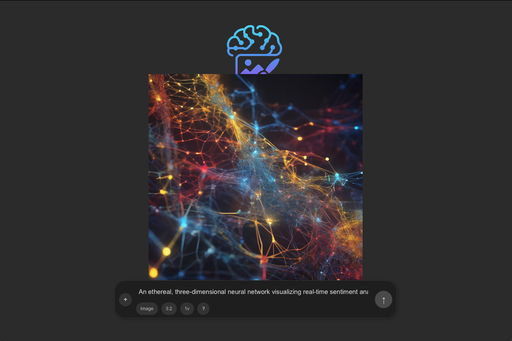

<p align="center">
  <!-- Replace this logo path with your own if you have one -->
  
  <h2 align="center">VisiGen</h2>
  <p align="center">Turn words into vivid images — right on your desktop.</p>
</p>

<p align="center">
  <!-- Shields.io badges you might want -->
  
  
  
 
  
</p>

By making this change, your Hugging Face badge should now display correctly on your project's README.

<p align="center">
  <a href="demo.gif">View Demo</a> ·
  <a href="https://github.com/dave21-py/VisiGen/issues/new?labels=bug&template=bug_report.md">Report Bug</a> ·
  <a href="https://github.com/dave21-py/VisiGen/issues/new?labels=enhancement&template=feature_request.md">Request Feature</a>
</p>

---

## ✨ Overview

**VisiGen** is a JavaFX desktop application that converts natural-language prompts into AI-generated images using a Stable Diffusion–style model hosted on Hugging Face. It’s designed for devs, designers, and AI enthusiasts who want a lightweight, offline-friendly front-end without the browser overhead.

* ⚡ **Fast** – one-click prompt ➜ preview in seconds  
* 🎨 **Customizable** – tweak prompt templates, aspect ratios, inference steps  
* 🖥️ **Desktop-native** – smooth JavaFX UI, no Electron bloat  
* 🔌 **Open API** – swap in any Hugging Face text-to-image endpoint with a single env var  

> **Status:** MVP complete · Feature roadmap in progress — PRs welcome!

---

## 🚀 Quick Start

```bash
# 1) Clone the repo
git clone https://github.com/dave21-py/VisiGen.git
cd VisiGen

# 2) Create and activate a virtual env (optional but recommended)
python3 -m venv venv            # Windows:  py -m venv venv
source venv/bin/activate        # Windows:  venv\Scripts\activate

# 3) Install helper scripts (gradle wrapper, env loader) 
pip install -r tools/requirements.txt

# 4) Set your API key
cp .env.example .env
# edit .env and add:
#   HF_API_KEY=hf_xxxxxxxxxxxxxxxxxxxxx

# 5) Build & run (macOS/Linux)
./gradlew clean run
# Windows PowerShell
.\gradlew.bat clean run
****

```bash
git clone https://github.com/dave21-py/huggingface-image-generator.git
```

#### Gradle Setup

```bash
gradle init --type java-application --dsl groovy --package app --test-framework junit-jupiter --use-defaults --overwrite 
```
#### Gradle commands

```bash
gradle clean build
```

```bash
gradle run
```

#### JavaFX Setup
##### Add a line to app/build.gradle
```bash
plugins {
    id 'application'
    id 'jacoco'
    id 'org.openjfx.javafxplugin' version '0.1.0'
}
```
#### Add a new block to the bottom of app/build.gradle:
```bash
javafx {
    version = "23.0.1"
    modules = [ 'javafx.controls', 'javafx.fxml', 'javafx.media' ]
}
```


### 👀 Demo Prompts

#### Prompt 1:
```bash
An ethereal, three-dimensional neural network visualizing real-time sentiment analysis from global data streams. Nodes pulse with color-coded light blue for positive, red for negative, yellow for neutral, interconnected by shimmering, flowing data pathways. Abstract, intricate, glowing, high detail, cinematic lighting, bokeh background.
```

<p align="center">

</p>

#### Prompt 2:
```bash
Interior of a futuristic autonomous vehicle. The windshield is a fully transparent, adaptive display showing AI-curated points of interest, navigation overlays, and personalized entertainment. Passengers interact with the system using natural language and subtle hand gestures. Luxurious, ambient lighting, wide-angle shot, detailed interior.
```

<p align="center">

</p>

#### Prompt 3:
```bash
A sunset over the ocean with glowing waves
```

<p align="center">

</p>


#### System Requirements

> Both MacOS and Windows supported.


## 🚀 Citation

If you find our work useful, please consider citing:

```
title={VisiGen},
  author={David Geddam},
  year={2025}
}
```

## 📭 Contact

For any questions, please raise a concern or contact us at
+ David Geddam [linkedin.com](https://www.linkedin.com/in/david-geddam/)
